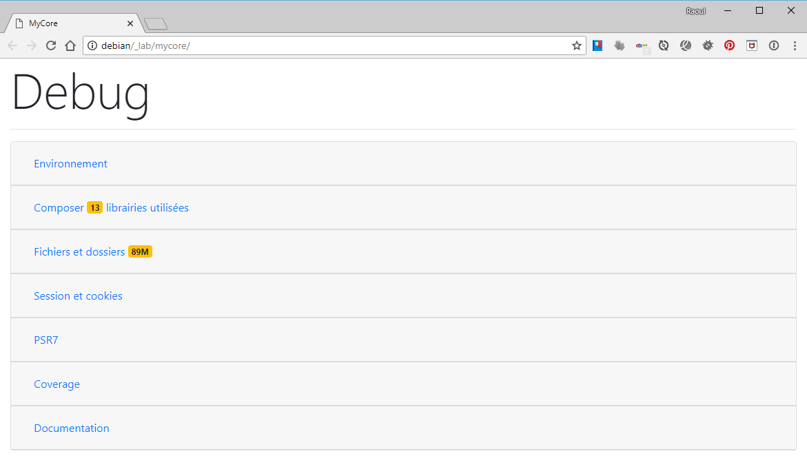

# My Core
> Librairies PHP.

-------

## Installation

<pre class="sh_sh">
 # Pour l'utiliser dans son projet
 composer require rcnchris/core
</pre>

-------

## Packages
> Un package regroupe un ensemble de classes.

### Tools
> Package qui regroupe les classes utilisées de manière autonomes un peu partout. Outils de gestion de base, tels que l'exécution de commandes shell, collections de données, accès aux fichiers et dossiers, debug...

#### Cmd
> Exécution de commandes *shell* et traitement du retour.

<pre class="sh_sh">
$ls = Cmd::exec("cd $path && ls");
</pre>

#### Environnement
> Fournit des méthodes d'interrogation de l'environnement.

<pre class="sh_sh">
$e = new Environnement();
$e->getPhpVersion();
</pre>

#### Html
> Fournit des méthodes de génération de balises HTML

<pre class="sh_sh">
Html::link('Google', 'http://google.fr', ['class' => 'btn btn-primary');
</pre>

#### Collection
> Facilite la manipulation des listes de données, tableaux multi-dimensionels...

<pre class="sh_sh">
$col = new Collection('ola,ole,oli', "Liste de valeurs dans une chaîne avec séparateur");
</pre>

#### Items
> Une autre classe de gestion des listes qui facilite la manipulation de tableaux multi-dimensionels...

<pre class="sh_sh">
$col = new Items('ola,ole,oli');
</pre>

#### Colors
> Gestion d'une palette de couleurs pré-définies ou définition d'une personnelle.

<pre class="sh_sh">
$colors = new Colors();
$colors->get('blue');
</pre>

#### Common
> Méthodes communes diverses.

<pre class="sh_sh">
$m = Common::getMemoryUse();
</pre>

#### Composer
> Facilite la lecture d'un fichier composer.json

<pre class="sh_sh">
$composer = new Composer('/path/to/file/composer.json');
$composer->get('name');
</pre>

#### Folder
> Facilite la lecture de fichiers et dossiers.

<pre class="sh_sh">
$folder = new Folder($path);
$size = $folder->size();
</pre>

#### Image
> Facilite la manipulation des images.

<pre class="sh_sh">
$img = new Image('path/to/file');
$src = $img->getEncode();
</pre>

#### Text
> Facilite la manipulation des chaînes de caractères.

<pre class="sh_sh">
$slug = Text::slug('Le slug qui va bien !');
</pre>

#### RandomItems
> Obtenir des données aléatoires.

<pre class="sh_sh">
$item = RandomItems::users();
$items = RandomItems::users(3);
$items = RandomItems::users(3, 'fr_FR');
</pre>

-------

### Session
> Ce package regroupe les classes de gestion des sessions et cookies.

#### Session
> Facilite la manipulation des sessions.

<pre class="sh_sh">
$session = new PHPSession();
$ip = $session->get('ip');
$cookies = $session->getCookies();
</pre>

#### Cookies
> Facilite la lecture des cookies.

<pre class="sh_sh">
$cookies = new PHPCookies();
$cookies->set('ip', '192.168.1.1')
</pre>

-------

## Apis
> Package qui permet d'utiliser n'importe qu'elle API facilement et quelques APIs dédiées.

### Curl
> Utiliser n'importe quelle API à partir de son URL.

<pre class="sh_sh">
$api = new Curl('https://randomuser.me/api');
$users = $api->exec(['results' => 3])->toArray();
</pre>

### AlloCiné
> Obtenir des informations de l'API.

<pre class="sh_sh">
$api = new AlloCine();
$search = $api->search('Le Parrain');
</pre>

-------

## ORM
> Abstraction des bases de données qui s'appuient sur `PDO`.

### SourcesManager
> Gestion de multiples sources de données hétérogènes (MySQL, SQLite, SQL Server...).

<pre class="sh_sh">
$manager = new SourcesManager($sources);
$pdo = $manager->connect($sourceName);
</pre>

### DbFactory
> Fournit une instance `PDO`.

<pre class="sh_sh">
$pdoSqliteMemory = DbFactory::get('memory', 0, '', '', '', 'sqlite');
$pdoSqliteFile = DbFactory::get('dbApp', 0, '', '', '', 'sqlite', '/path/to/file');
$pdoMysql = DbFactory::get('192.168.1.1', 3306, 'user', 'secret', 'home', 'mysql');
$pdoSqlsrv = DbFactory::get('MYSERVER\SQLEXPRESS', 1433, 'user', 'secret', 'home', 'sqlsrv');
</pre>

### Table
> Fournit l'instance d'une table dans une base de données.

<pre class="sh_sh">
$users = new Table('users', $db);
$users->query()->all()->toArray();
</pre>

### Query
> Effectuer une requête sur une connexion `PDO`.

<pre class="sh_sh">
$query = (new Query($pdo))->from('departements', 'dep');
$count = $query->count();
$items = $query->all()->toArray();

$query = (new Query($pdo))
            ->from('posts')
            ->where('category_id = 3')
            ->order('title');
$result = $query->all()->toArray();
</pre>

### QueryResult
> Représente le résultat d'une requête. Permet de gérer l'hydratation des objets qui contiennent les données issues de la bases de données.

<pre class="sh_sh">
$result = (new DepartementsModel($pdo))->makeQuery();
</pre>

### Model
> Représente une table identifiée

<pre class="sh_sh">
$users = new UsersModel($db);
</pre>

### Entity
> Représente un enregistrement d'une table

<pre class="sh_sh">
$user = (new UsersModel($db))->find(1);
</pre>

-------

## PDF
> Génération de documents PDF.

<pre class="sh_sh">
$pdf = new AbstractPDF();

// Sauvegarder le fichier sur le serveur
$pdf->toFile(/path/to/file/filename);

// Télécharger via le navigateur
$pdf->toDownload(ResponseInterface $response, 'filename');

// Visualiser dans le navigateur
$pdf->toView(ResponseInterface $response, 'filename');
</pre>

<em>Les comportements sont gérés via des traits :</em>

<dl>
    <dt>Signets</dt>
    <dd>Helper de gestion hiérarchique des signets.</dd>
    <dt>Couleurs</dt>
    <dd>Helper d'utilisation d'une palette de couleurs. Permet d'utiliser des couleurs nommées.</dd>
    <dt>Données</dt>
    <dd>Helper d'utilisation d'une collection de données.</dd>
    <dt>Codes à barres</dt>
    <dd>Helper de génération de codes à barres.</dd>
    <dt>Cercles et ellipses</dt>
    <dd>Helper de génération de cercles et ellipses.</dd>
    <dt>Rectangles arrondis</dt>
    <dd>Helper de génération des rectangles avec les bords arrondis. Les comportements sotn gérés comme la prorpiété CSS <code>radius</code>.</dd>
    <dt>Rotation de texte et d'image</dt>
    <dd>Helper de rotation de textes et d'images.</dd>
    <dt>Grille graduée</dt>
    <dd>Helper de génération de pages avec une grille graduée. Utile pour le développement.</dd>
    <dt>Colonnes et lignes</dt>
    <dd>Helper de génération de tableaux.</dd>
    <dt>Icônes</dt>
    <dd>Helper de génération d'icônes.</dd>
    <dt>Fichier attaché</dt>
    <dd>Helper de gestion des fichiers attachés.</dd>
    <dt>PSR7</dt>
    <dd>Permet de visualiser ou télécharger le document à partir du navigateur en respectant la norme du <a href="https://www.php-fig.org/psr/psr-7/" target="_blank">PSR7</a>.</dd>
</dl>

-------

## Twig
> Ajoute des extensions à Twig.

<dl>
    <dt>Debug</dt>
    <dd>Outils et fonctions de debug</dd>
    <dt>Texte</dt>
    <dd>Helper de manipulation des chaînes de caractères</dd>
    <dt>Fichiers et dossiers</dt>
    <dd>Helper de manipulation des fichiers et dossiers</dd>
    <dt>Dates</dt>
    <dd>Helper de manipulation des dates</dd>
    <dt>Tableaux</dt>
    <dd>Helper de manipulation des tableaux</dd>
    <dt>HTML</dt>
    <dd>Génération de balises HTML</dd>
    <dt>Formulaire</dt>
    <dd>Génération de balises HTML spécifiques aux formulaires HTML</dd>
    <dt>Icônes</dt>
    <dd>Génération d'icônes à partir de poclices spécialisées</dd>
    <dt>Bootstrap 4</dt>
    <dd>Génération de balises HTML qui utilisent les classes de <code>Bootstrap 4</code></dd>
    <dt>Highcharts</dt>
    <dd>Génération de graphiques à l'aide de la libraire <code>Highcharts</code></dd>
    <dt>Messages Flash</dt>
    <dd>Helper de génération de messages flash</dd>
</dl>

-------

## Middlewares PSR7

<dl>
    <dt>Boot</dt>
    <dd>Démarrage de l'application. Définition de la localisation, environnement et constantes.</dd>
    <dt>PoweredBy</dt>
    <dd>Ajoute un tag aux headers de la réponse.</dd>
    <dt>Session</dt>
    <dd>Gestion de la session utilisateur.</dd>
    <dt>Cookies</dt>
    <dd>Gestion des cookies.</dd>
</dl>

-------

## Home en mode debug

## Todo <progress></progress>

<dl>
    <dt>Synology</dt>
    <dd>
        - Utilisation des cookies.
    </dd>
    <dt>Twig</dt>
    <dd>
        - <code>ArrayExtension</code> : Améliorer toHml pour pouvoir déterminer le sens du tableau
    </dd>
</dl>

-------
